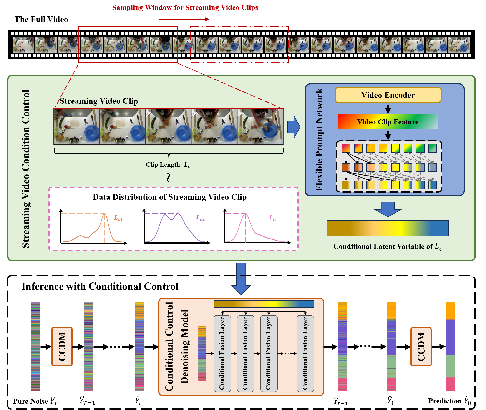

# Flexible Streaming Temporal Action Segmentation with Diffusion Models

This is the code for "Flexible Streaming Temporal Action Segmentation with Diffusion Models".



## Environment preparation

- Linux Ubuntu 22.04+

- Python 3.10+

- PyTorch 2.1.0+

- CUDA 12.2+

- use pip to install environment 

  ```python
  pip install -r requirements.txt
  ```

## Dataset and pre-training parameters preparation

prepare data follow below instruction.
- data directory file tree
```txt
─── data
    ├── 50salads
    ├── breakfast
    ├── gtea
    ├── checkpoint
    └── ...
```

The video action segmentation model uses [GTEA](https://cbs.ic.gatech.edu/fpv/), [50Salads](https://cvip.computing.dundee.ac.uk/datasets/foodpreparation/50salads/), and [Breakfast](https://serre-lab.clps.brown.edu/resource/breakfast-actions-dataset/)

To download I3D feature from [MS-TCN](https://github.com/yabufarha/ms-tcn) repo.

- Dataset tree example
```txt
─── gtea
    ├── Videos
    │   ├── S1_Cheese_C1.mp4
    │   ├── S1_Coffee_C1.mp4
    │   ├── S1_CofHoney_C1.mp4
    │   └── ...
    ├── groundTruth
    │   ├── S1_Cheese_C1.txt
    │   ├── S1_Coffee_C1.txt
    │   ├── S1_CofHoney_C1.txt
    │   └── ...
    ├── splits
    │   ├── test.split1.bundle
    │   ├── test.split2.bundle
    │   ├── test.split3.bundle
    │   └── ...
    └── mapping.txt
```

We use Swinformer3D pre-trained on Kinetics600 as the video encoder for the model, and the pre-training parameters can be obtained from this [link]([GitHub - SwinTransformer/Video-Swin-Transformer: This is an official implementation for "Video Swin Transformers".](https://github.com/SwinTransformer/Video-Swin-Transformer)).

## Reproduce our results

We provided the model parameters that we trained on [GTEA](https://drive.google.com/file/d/1EDg3n9dwlnlZ1xXykvmvofQfXgm8S3gC/view?usp=drive_link), [50Salads](https://drive.google.com/file/d/1EDg3n9dwlnlZ1xXykvmvofQfXgm8S3gC/view?usp=drive_link), and [Breakfast](https://drive.google.com/file/d/1y1uVNR-hGt8jKRNV8r9tptqXZIhO_vRE/view?usp=drive_link).

You can add the model parameter path monkey to the config file and directly use the test script we provide to reproduce the results in the paper.

```
sh scripts/test.sh
```

## Train by yourself

You can also directly use the training script we provide to retrain.

```
sh scripts/train.sh
```

It should be noted that all of our training was completed on  NVIDIA RTX 4090.

## Acknowledgement

This repo borrowed code from many great open source libraries, thanks again for their selfless dedication.

- [SVTAS](https://github.com/Thinksky5124/SVTAS)
- [paddlevideo](https://github.com/PaddlePaddle/PaddleVideo)
- [mmaction2](https://github.com/open-mmlab/mmaction2)